<!--
================================================================
 PROFILE CONFIGURATION - edit before publishing
================================================================
 Replace each "#" placeholder below with the real URL, then
 update the matching href="#" in the sections that follow.

 PORTFOLIO_URL      = #
 LINKEDIN_URL       = #
 HACKERRANK_URL     = #
 LEETCODE_URL       = #
 POSTMAN_URL        = #
 YOUTUBE_URL        = #
 MEDIUM_URL         = #
 STACKOVERFLOW_URL  = #
 BUYMEACOFFEE_URL   = #

 BLOG FEED (Latest Blog Posts section)
 FEED_URL           = #

 CERTIFICATIONS (Certifications section)
 Add only verified certificates: title, issuer, credential URL.

 NOTE: only GitHub is linked for real right now - the remaining
 badges are clearly marked placeholders (href="#").
================================================================
-->

  

  <h1>Hi, I'm Deepesh 👋</h1>

  

  

    B.Tech Computer Engineering student building <b>full-stack web applications</b> 
    and <b>real-time AI / computer vision</b> projects.
  

  

    
    
    
  

## 👨‍💻 About Me

- 🎓 B.Tech Computer Engineering student (2025 - 2029)
- 💻 Building full-stack web applications with React, TypeScript and Node.js
- 🤖 Working on real-time AI and computer vision projects with YOLO, OpenCV and MediaPipe
- 🌱 Sharpening data structures, algorithms and software design fundamentals
- 🚀 Deploying finished projects on Vercel, Firebase and Supabase

Open to software engineering internships and open-source collaboration.

## 🌐 Connect With Me

<!-- Replace each href="#" with the URL from the PROFILE CONFIGURATION block at the top. -->

  
  
  
  
  
  
  
  
  

## 🛠️ Tech Stack

### Languages

  
  
  
  
  

### Frontend

  
  
  
  
  

### Backend

  
  
  
  
  
  

### AI / Computer Vision

  
  
  
  
  

### Cloud / DevOps

  
  
  
  
  

## 🧩 My Skills Set

<table>
<tr>
<td align="center" width="33%">

### Frontend

</td>
<td align="center" width="33%">

### Backend

</td>
<td align="center" width="33%">

### DevOps

</td>
</tr>
</table>

## 📊 GitHub Statistics

  
  

  

## 📈 Contribution Activity

  
   
  Contributions over the last year

## 📝 Latest Blog Posts

> **No public blog feed is connected yet.** Add an RSS, Dev.to or Medium URL to the
> `FEED_URL` placeholder in the configuration block at the top of this file to publish
> the latest posts here automatically.

<!--
 BLOG FEED
 Supported sources (no API key required):
   Dev.to  -> dev.to/api/articles?username=YOUR_DEVTO_NAME
   Medium  -> medium.com/feed/@YOUR_MEDIUM_NAME
   RSS     -> any public Atom/RSS feed
 Add the workflow that renders FEED_URL, then drop the rendered cards below.
 FEED_URL = #
-->

## 🏆 Hacktoberfest

  
   
  Hacktoberfest badges will appear on this board once they are earned - nothing
  is displayed before it actually exists.

## 🏅 Certifications

  <b>No certifications published yet.</b> Verified certificates - title, issuer and
  credential link - will be listed here as they are earned.

<!--
 CERTIFICATIONS TEMPLATE (only add verified certificates)

 <table>
   <tr>
     <td><b>Certification name</b> Issuer</td>
     <td align="center"><a href="credential-url">View credential</a></td>
   </tr>
 </table>
-->

## 💡 Random Dev Quote

  

## 🐍 Contribution Snake

  
   
  <picture>
    <source media="(prefers-color-scheme: dark)" srcset="https://raw.githubusercontent.com/deepsh3969/deepsh3969/output/github-snake-dark.svg" />
    <source media="(prefers-color-scheme: light)" srcset="https://raw.githubusercontent.com/deepsh3969/deepsh3969/output/github-snake.svg" />
    
  </picture>
   
  Refreshed daily by the <a href="https://github.com/deepsh3969/deepsh3969/actions/workflows/snake.yml">Generate Contribution Snake</a> workflow.

### Thanks for visiting my profile! 🚀

